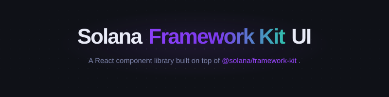

<p align="center">
  
</p>

> The missing wallet UI for [Solana Framework Kit](https://github.com/solana-foundation/framework-kit).

[](https://www.npmjs.com/package/solana-framework-kit-ui)
[](https://github.com/0xEdouardEth/solana-framework-kit-ui/actions)
[](./LICENSE)

> **Live demo:** _coming soon_

Lightweight wallet connection UI built on top of [Framework Kit](https://github.com/solana-foundation/framework-kit).
Discovers any installed Solana wallet automatically — Phantom, Backpack, Solflare, and more.

**Desktop** → centered modal. **Mobile** → bottom sheet.

---

## Features

- **Auto-discovery** — finds all installed Wallet Standard wallets automatically
- **CSS custom properties** — full theming with zero runtime cost
- **Dark & light themes** — built-in, easily extended
- **Bottom sheet on mobile** — pure CSS, no JS required
- **Accessible** — ARIA roles, keyboard navigation, focus management
- **Tiny** — no bundled dependencies, peer dep on Framework Kit
- **i18n** — 10 languages: English, French, Spanish, German, Chinese, Japanese, Portuguese, Russian, Korean, Arabic

---

## Installation

```bash
# bun
bun add solana-framework-kit-ui @solana/client @solana/react-hooks

# npm
npm install solana-framework-kit-ui @solana/client @solana/react-hooks

# yarn
yarn add solana-framework-kit-ui @solana/client @solana/react-hooks

# pnpm
pnpm add solana-framework-kit-ui @solana/client @solana/react-hooks
```

---

## Quick start

```tsx
// main.tsx
import { createClient, autoDiscover } from "@solana/client";
import { SolanaProvider } from "@solana/react-hooks";
import { SolanaUIProvider, ConnectButton } from "solana-framework-kit-ui";

const client = createClient({
  cluster: "mainnet-beta",
  walletConnectors: autoDiscover(), // discovers all installed Wallet Standard wallets
});

export default function App() {
  return (
    <SolanaProvider client={client}>
      <SolanaUIProvider>
        <ConnectButton />
      </SolanaUIProvider>
    </SolanaProvider>
  );
}
```

That's it. `<ConnectButton>` handles all wallet states — disconnected, connecting, and connected.

---

## Using hooks directly

```tsx
import { useWalletConnection, useBalance } from "@solana/react-hooks";

function Dashboard() {
  const { connected, wallet, disconnect } = useWalletConnection();
  const { lamports } = useBalance(wallet?.account.address ?? "");

  if (!connected) return <p>Not connected</p>;

  return (
    <div>
      <p>Address: {wallet.account.address}</p>
      <p>Balance: {(Number(lamports ?? 0) / 1e9).toFixed(4)} SOL</p>
      <button onClick={disconnect}>Disconnect</button>
    </div>
  );
}
```

---

## Theming

### Dark / light

```tsx
<SolanaProvider client={client}>
  <SolanaUIProvider colorScheme="light">
    <ConnectButton />
  </SolanaUIProvider>
</SolanaProvider>
```

### Custom accent

```tsx
<SolanaProvider client={client}>
  <SolanaUIProvider theme={{ accent: "#14F195", accentForeground: "#0a0a0a" }}>
    <ConnectButton />
  </SolanaUIProvider>
</SolanaProvider>
```

### Full CSS override

```css
.sfk-root {
  --sfk-accent: #ff6b6b;
  --sfk-radius: 8px;
  --sfk-font: "Inter", sans-serif;
}
```

See [docs/API.md](./docs/API.md) for the full token reference.

---

## Components

| Component            | Description                                                  |
| -------------------- | ------------------------------------------------------------ |
| `<SolanaUIProvider>` | Root provider — injects CSS theme variables + config context |
| `<ConnectButton>`    | All-in-one button (all wallet states handled)                |
| `<WalletModal>`      | Standalone modal / bottom sheet                              |
| `<WalletIcon>`       | Wallet icon with fallback                                    |
| `<AccountDisplay>`   | Connected address with copy + disconnect                     |
| `<Identicon>`        | Address-based gradient avatar                                |

See [docs/API.md](./docs/API.md) for full props reference.

---

## Framework Kit compatibility

| `@solana/react-hooks` | `@solana/client` | This library |
| --------------------- | ---------------- | ------------ |
| ≥ 1.0.0               | ≥ 1.0.0          | 0.x          |

---

## Contributing

See [CONTRIBUTING.md](./CONTRIBUTING.md).

---

## License

MIT © [0xEdouardEth](https://github.com/0xEdouardEth)
